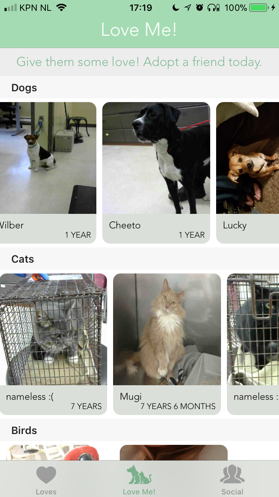

# Programmeerproject

### Project Proposal 'Love Me Adopt Me'
###### Created by Jet van den Berg

Deze app toont dieren uit een dierenasiel, die 'geliket' kunnen worden door de gebruiker. Deze 'gelikete' dieren komen in een 'like'-lijst te staan van deze gebruiker. Door op een dier te klikken, worden de details weergegeven. Op basis hiervan kan een gebruiker bepalen of hij dit dier wel of niet in zijn lijst zet. Deze lijst kan ook gedeeld worden met vrienden, die te zoeken zijn op hun e-mailadres, en waarmee gechat kan worden. Een gebruiker kan ook zelf een dier toevoegen aan zijn lijst. Zie de sketches hieronder voor de visualisatie van deze proposal.

## Problem statement

Elke dag worden er nieuwe huisdieren in een dierenasiel geplaatst, terwijl het aantal dieren dat geadopteerd wordt, lager lijkt te zijn. Het adopteren van een huisdier is dan ook geen beslissing die vaak gemaakt wordt als men een huisdier in huis wilt nemen. Dit project zal uit een app bestaan die een overzicht geeft van een dierenasiel met dieren die geadopteerd kunnen worden.

## Problem solution

Een oplossing op bovenstaand probleem is een app met een lijst van dieren die momenteel in het dierenasiel zitten, die op een eenvoudige manier via de app 'geliket' kunnen worden, waardoor de 'gelikete' dieren in een favorietenlijst komen te staan. Een populair middel om bepaalde items op te slaan in een app is door dit item te 'liken'. Deze app moet het adopteren van een huisdier uiteindelijk toegankelijker maken, en daarmee dan ook bekender onder gebruikers.

## Data sources
* Lost, found, adoptable pets: https://data.sonomacounty.ca.gov/Government/Animal-Shelter-Intake-and-Outcome/924a-vesw (API: https://data.kingcounty.gov/resource/murn-chih.json)
* Animal Shelter Intake and Outcome API: https://data.kingcounty.gov/Pets/Lost-found-adoptable-pets/yaai-7frk (API: https://data.sonomacounty.ca.gov/resource/nzbr-wh3q.json)
* Dog CEO API: https://dog.ceo/dog-api/#all
* The Dog API: https://www.thedogapi.co.uk/
* Giphy API: https://developers.giphy.com/docs/

## External libraries
* Firebase

## Similar mobile apps
* BarkBuddy: een Tinder-achtige app, die 'adoptable pups' in de buurt van de gebruiker toont. Meer info van een puppy kan getoond worden, er kan worden gedeeld met vrienden, en puppies kunnen aan favorieten toegevoegd worden. De lay-out is hetzelfde als de Tinder-app.
* YES PET! - Adopt or Buy Dog & Cat Today: laat asielen in de buurt zien, met honden of katten die in het betreffende dierenasiel zitten.

## Hardest parts
Het vinden van een API voor Nederlandse dierenasielen. Momenteel heb ik vooral Amerikaanse API’s gevonden. Ook welke API nou echt geschikt zal zijn, moet nog goed uitgezocht worden.

